# ER Diagram — Physical Data Model

Nguồn sự thật là `apps/server/prisma/schema.prisma` — tài liệu này diễn giải lại schema đó dưới dạng ER diagram (thiết kế vật lý dữ liệu). Đi kèm với `CLASS_DIAGRAM.md` (thiết kế domain/hành vi) — hai tài liệu mô tả **cùng một hệ thống ở hai mức khác nhau**, xem §3 để hiểu cách ánh xạ từ file kia sang file này.

## 1. Sơ đồ

```mermaid
erDiagram
    users {
        string id PK
        string email UK
        string passwordHash "nullable"
        string googleId UK "nullable"
        string role "enum CANDIDATE|EMPLOYER|ADMIN"
        string status "enum PENDING_VERIFICATION|ACTIVE|SUSPENDED"
        datetime emailVerifiedAt "nullable"
        datetime createdAt
        datetime updatedAt
    }

    majors {
        string id PK
        string name UK
    }
    universities {
        string id PK
        string name UK
        string code UK "nullable"
    }
    industries {
        string id PK
        string name UK
    }
    cities {
        string id PK
        string name UK
        string zipcode "nullable"
    }
    company_types {
        string id PK
        string name UK
    }
    skills {
        string id PK
        string name UK
    }

    students {
        string id PK
        string userId FK "unique"
        string headline "nullable"
        string bio "nullable"
        string phone "nullable"
        datetime dateOfBirth "nullable"
        string gender "nullable, enum MALE|FEMALE|OTHER"
        string avatarUrl "nullable"
        string cityId FK "nullable"
        datetime createdAt
        datetime updatedAt
    }

    educations {
        string id PK
        string studentId FK
        string universityId FK "nullable"
        string majorId FK "nullable"
        string degree "nullable"
        int startYear "nullable"
        int endYear "nullable"
        boolean isCurrent
        string description "nullable"
        datetime createdAt
    }

    work_experiences {
        string id PK
        string studentId FK
        string company
        string position
        datetime startDate "nullable"
        datetime endDate "nullable"
        boolean isCurrent
        string description "nullable"
        datetime createdAt
    }

    projects {
        string id PK
        string studentId FK
        string name
        string description "nullable"
        string url "nullable"
        boolean isWorkingOn
        datetime startDate "nullable"
        datetime endDate "nullable"
        datetime createdAt
    }

    certificates {
        string id PK
        string studentId FK
        string name
        string issuer "nullable"
        datetime issueDate "nullable"
        string credentialUrl "nullable"
        string description "nullable"
        datetime createdAt
    }

    awards {
        string id PK
        string studentId FK
        string name
        string issuer "nullable"
        datetime date "nullable"
        string description "nullable"
        datetime createdAt
    }

    student_skills {
        string studentId PK,FK
        string skillId PK,FK
        float yearsOfExperience
    }

    companies {
        string id PK
        string name
        string description "nullable"
        string logoUrl "nullable"
        string bannerUrl "nullable"
        string website "nullable"
        string industryId FK "nullable"
        string companyTypeId FK "nullable"
        string cityId FK "nullable"
        string address "nullable"
        string taxCode UK "nullable"
        int foundedYear "nullable"
        boolean isVerified
        boolean requiresApproval
        datetime verifiedAt "nullable"
        datetime createdAt
        datetime updatedAt
    }

    employers {
        string id PK
        string userId FK "unique"
        string companyId FK
        boolean isCompanyAdmin
        string title "nullable"
        string phone "nullable"
        datetime createdAt
        datetime updatedAt
    }

    subscription_plans {
        string id PK
        string name UK
        string description "nullable"
        int jobPostQuota
        int durationDays
        int price "VND, không có phần thập phân"
        boolean isActive
        datetime createdAt
        datetime updatedAt
    }

    company_subscriptions {
        string id PK
        string companyId FK
        string planId FK
        datetime startDate
        datetime endDate
        string status "enum PENDING|ACTIVE|EXPIRED|CANCELLED"
        datetime createdAt
        datetime updatedAt
    }

    payments {
        string id PK
        string companySubscriptionId FK
        int amount "VND"
        string status "enum PENDING|COMPLETED|FAILED"
        datetime createdAt
        datetime updatedAt
    }

    transactions {
        string id PK
        string paymentId FK
        string paymentMethodId FK
        string orderCode UK
        string providerTransactionId UK "nullable"
        string rawResponse "nullable"
        string status "enum INIT|SUCCESS|FAILED"
        datetime createdAt
    }

    payment_callback_logs {
        string id PK
        string provider "enum VNPAY|MOMO"
        string rawQueryString "nullable"
        string rawPayload "nullable"
        datetime receivedAt
    }

    payment_methods {
        string id PK
        string displayName UK
        string logoUrl "nullable"
        boolean isAvailable
        string processorType "enum VNPAY|MOMO"
        json configParams "nullable"
        datetime createdAt
        datetime updatedAt
    }

    job_posts {
        string id PK
        string companyId FK
        string title
        string description
        string jobType "enum INTERNSHIP|PART_TIME|FULL_TIME|CONTRACT"
        string status "enum DRAFT|PENDING|PUBLISHED|EXPIRED|CLOSED|TAKEN_DOWN"
        int salaryMin "nullable"
        int salaryMax "nullable"
        boolean isNegotiable
        string requirements "nullable"
        string benefits "nullable"
        string cityId FK "nullable"
        string address "nullable"
        string industryId FK "nullable"
        datetime publishedAt "nullable"
        datetime expiresAt "nullable"
        datetime closedAt "nullable"
        datetime createdAt
        datetime updatedAt
    }

    job_post_skills {
        string jobPostId PK,FK
        string skillId PK,FK
    }

    job_post_moderation_actions {
        string id PK
        string jobPostId FK
        string action "enum SUBMITTED|APPROVED|REJECTED|RETRACTED"
        string actorId FK "nullable"
        string reason "nullable"
        datetime createdAt
    }

    cvs {
        string id PK
        string studentId FK
        string fileUrl
        string fileName
        boolean isDefault
        datetime uploadedAt
    }

    saved_jobs {
        string id PK
        string studentId FK
        string jobPostId FK
        datetime createdAt
    }

    applications {
        string id PK
        string jobPostId FK
        string studentId FK
        string cvId FK
        string status "enum PENDING|REVIEWING|SHORTLISTED|INTERVIEWING|ACCEPTED|REJECTED"
        string coverLetter "nullable"
        string employerNotes "nullable, chỉ Employer xem"
        int rating "nullable, chỉ Employer xem"
        datetime createdAt
        datetime updatedAt
    }

    conversations {
        string id PK
        string jobPostId FK "nullable"
        string studentId FK
        string employerId FK
        datetime studentLastReadAt "nullable"
        datetime employerLastReadAt "nullable"
        datetime createdAt
        datetime updatedAt
    }

    messages {
        string id PK
        string conversationId FK
        string senderId FK
        string content
        datetime createdAt
    }

    notifications {
        string id PK
        string userId FK
        string type "enum"
        string title
        string body "nullable"
        string link "nullable"
        boolean isRead
        datetime createdAt
    }

    users ||--o| students : "1-1"
    users ||--o| employers : "1-1"
    cities o|--o{ students : "optional"
    cities o|--o{ companies : "optional"
    cities o|--o{ job_posts : "optional"
    industries o|--o{ companies : "optional"
    industries o|--o{ job_posts : "optional"
    company_types o|--o{ companies : "optional"

    students ||--o{ educations : "cascade"
    universities o|--o{ educations : "optional"
    majors o|--o{ educations : "optional"
    students ||--o{ work_experiences : "cascade"
    students ||--o{ projects : "cascade"
    students ||--o{ certificates : "cascade"
    students ||--o{ awards : "cascade"
    students ||--o{ cvs : "cascade"
    students ||--o{ student_skills : "cascade"
    skills ||--o{ student_skills : "cascade"

    companies ||--o{ employers : "required, restrict"
    companies ||--o{ job_posts : "required, restrict"

    companies ||--o{ company_subscriptions : "required, restrict"
    subscription_plans ||--o{ company_subscriptions : "required, restrict"
    company_subscriptions ||--o{ payments : "required, restrict"
    payments ||--o{ transactions : "required, restrict"
    payment_methods ||--o{ transactions : "required, restrict"

    job_posts ||--o{ job_post_moderation_actions : "cascade"
    users o|--o{ job_post_moderation_actions : "actor, optional"
    job_posts ||--o{ job_post_skills : "cascade"
    skills ||--o{ job_post_skills : "cascade"

    students ||--o{ applications : "cascade"
    job_posts ||--o{ applications : "cascade"
    cvs ||--o{ applications : "required, restrict"

    students ||--o{ saved_jobs : "cascade"
    job_posts ||--o{ saved_jobs : "cascade"

    job_posts o|--o{ conversations : "optional"
    students ||--o{ conversations : "cascade"
    employers ||--o{ conversations : "cascade"
    conversations ||--o{ messages : "cascade"
    users ||--o{ messages : "sender, required"

    users ||--o{ notifications : "cascade"
```

## 2. Quy ước đọc sơ đồ

- Tên bảng snake_case số nhiều (`@@map` trong schema), khớp `DATABASE_DESIGN.md` §"Quy ước chung".
- `PK` = khoá chính (`String @id @default(cuid())` cho mọi bảng, trừ 2 bảng nối `student_skills`/`job_post_skills` dùng PK composite).
- `FK` = khoá ngoại. `UK` = unique constraint (độc lập với PK).
- `"nullable"` trong cột ghi chú = FK/field optional trong schema — quyết định business (không phải thiếu sót) đã ghi rõ lý do ở `DATABASE_DESIGN.md`/`INITIAL_ARCHITECTURE_PLAN.md`.
- Nhãn quan hệ (`"cascade"`, `"required, restrict"`, `"optional"`) lấy đúng theo `onDelete` khai báo trong `schema.prisma`, không suy đoán.
- **Không có bảng** cho OTP/refresh-token — cả hai là dữ liệu ephemeral (TTL-bound), sống trong Redis, không phải PostgreSQL (quyết định đã chốt, `DATABASE_DESIGN.md` §"Users & auth").
- **Không có cột** `companies.retraction_count` — giá trị derive tại query-time từ `job_post_moderation_actions` (đếm `action='RETRACTED'`), tránh dữ liệu lệch khỏi audit log.
- **`payment_callback_logs` không có FK** tới `transactions`/`payments` — log thô mọi callback nhận được, kể cả khi không khớp được giao dịch nào (sai chữ ký, gọi trùng), cố tình tách biệt khỏi luồng nghiệp vụ để tra soát sau này.

## 3. Ánh xạ từ Class Diagram sang ER Diagram

### 3.1 Vì sao ánh xạ gần như 1–1 được

Domain model của dự án được thiết kế **đồng thời** với ORM quan hệ (Prisma + PostgreSQL) ngay từ Phase 1, không phải một domain model OOP thuần tuý rồi mới tìm cách ánh xạ về sau (persistence-first modelling, không phải domain-first). Vì vậy tỉ lệ 1 class ↔ 1 table gần như trực tiếp là **chủ đích thiết kế**, không phải trùng hợp — đổi lại, domain model không dùng các pattern OOP mà quan hệ (relational) không biểu diễn tự nhiên được (đa hình runtime thật, table inheritance...), như đã nêu ở `CLASS_DIAGRAM.md` §1 (bỏ generalization `User → Student/Employer`).

### 3.2 Bảng quy tắc ánh xạ

| Khái niệm ở Class Diagram | Khái niệm ở ER Diagram | Quy tắc |
|---|---|---|
| Class có identity riêng (`id`) | Table | Mỗi class domain (không phải value object/enum) → đúng 1 bảng, tên snake_case số nhiều |
| Attribute (kiểu scalar) | Column | Giữ nguyên ngữ nghĩa, đổi tên `camelCase → snake_case` khi map thật vào SQL (Prisma tự làm qua `@@map`/field mapping); kiểu dữ liệu: `String→text/varchar`, `Int→integer`, `Float→double precision`, `Boolean→boolean`, `DateTime→timestamp` |
| `<<enumeration>>` | Postgres native `ENUM` type | Tập giá trị hữu hạn, cố định tại thời điểm migrate → dùng enum native của Postgres thay vì bảng danh mục riêng (khác với `Major`/`University`/... vốn *có thể* thêm giá trị runtime qua Admin CRUD nên phải là bảng) |
| Association 1–0..1 (vd `User`–`Student`) | FK **UNIQUE** trên bảng "phụ thuộc" (`students.user_id`) | Bên nào giữ FK + UNIQUE là bên biểu diễn multiplicity `0..1` trong quan hệ 1–1; đây cũng là cách hiện thực thay cho generalization (không có bảng cha–con dùng chung PK) |
| Composition (●──, 1 cha – nhiều con, con không tồn tại độc lập) | FK **NOT NULL + `ON DELETE CASCADE`** trên bảng con | Xoá cha thì xoá luôn con — đúng ngữ nghĩa "con không có lý do tồn tại khi cha mất" (vd `students.id` xoá → `educations` cascade xoá theo) |
| Aggregation (○──, FK bắt buộc nhưng không cascade) | FK **NOT NULL**, `ON DELETE RESTRICT` (mặc định của Prisma khi không khai báo `onDelete`) | Con phụ thuộc cha để hợp lệ, nhưng DB **chặn xoá cha** nếu còn con tham chiếu, thay vì tự động xoá theo (vd không thể xoá `companies` nếu còn `job_posts` thuộc công ty đó) |
| Association thường (── , FK optional) | FK **nullable**, không cascade | Quan hệ tham chiếu/catalog, không mang ý nghĩa sở hữu (vd `students.university_id` nullable) |
| Association class (N–N có attribute riêng, vd `StudentSkill`) | **Bảng nối (junction table)** với ≥2 FK, PK composite hoặc PK riêng | Attribute riêng của quan hệ đó (`years_of_experience`, `last_read_at`) nằm ngay trên bảng nối — đây là lý do UML dùng "association class" thay vì mũi tên N–N thuần (N–N thuần không có chỗ chứa attribute) |
| Method (behavior trên class) | **Không map trực tiếp** | ER diagram chỉ mô tả cấu trúc dữ liệu tĩnh (structure), không mô tả hành vi — đây là lý do 2 diagram phục vụ 2 mục đích khác nhau (xem §3.3) |
| Derived/computed method (`Company.retractionCount()`) | **Không có cột lưu trữ** | Giá trị tính tại query-time từ bảng khác (`job_post_moderation_actions`), đúng nguyên tắc ER modeling "derived attribute không lưu vật lý" — tránh denormalization risk (dữ liệu lệch khỏi nguồn thật khi có bug ở chỗ tăng/giảm counter thủ công) |

### 3.3 Vì sao method không map — nhưng vẫn "gợi ý" cấu trúc bảng

Method mô tả **hành vi tại một thời điểm** (transition, validation), còn ER diagram mô tả **trạng thái được lưu trữ**. Method không tạo ra cột mới, nhưng có 2 trường hợp method ảnh hưởng gián tiếp tới thiết kế bảng:

1. **Method cần audit trail** → sinh ra bảng log riêng. Ví dụ 5 method state-machine trên `JobPost` (`submitForApproval/publish/approve/reject/retract`) đều cần lưu lại "ai, làm gì, khi nào, vì sao" — đây chính là lý do tồn tại bảng `job_post_moderation_actions`, dù bảng này không map từ bất kỳ attribute nào của `JobPost`, mà map từ **hệ quả của các method** đó.
2. **Method tính derived value** → **không** sinh cột, mà xác nhận rằng cột đó *cố ý không tồn tại* (`Company.retractionCount()` → không có `companies.retraction_count`).

Ngược lại, ER diagram cũng "phản hồi" lại class diagram: cardinality thật của DB (`unique(jobPostId, studentId)` trên `applications`) chính là invariant mà method `Application.submit()` phải tôn trọng — 2 tài liệu ràng buộc lẫn nhau, không phải một chiều.
